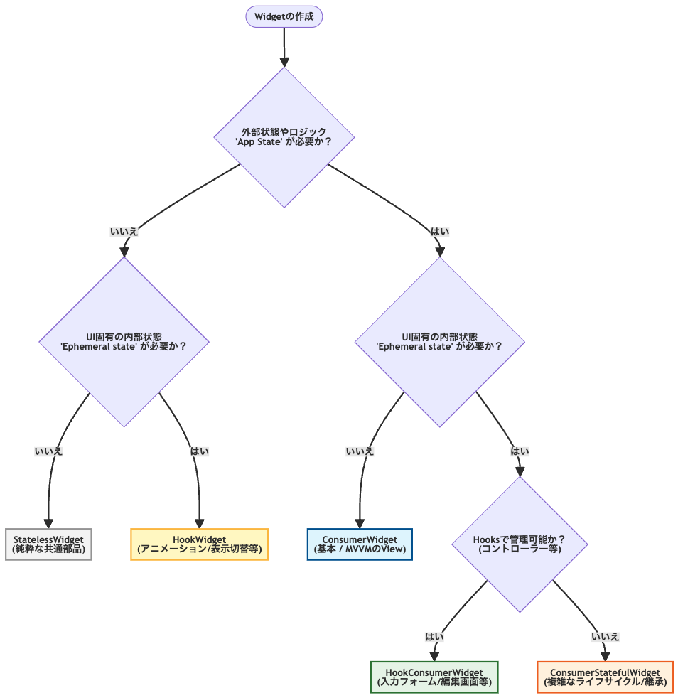

# Widget選び<br>状態管理に迷わないためのフローチャート

状態管理は「どこで管理するか」が明確になれば迷わない

---

# 「宣言的UI」と「命令的UI」 

---

# 宣言的UI vs 命令的UI

**命令的UI（タクシーの例）**
- 「次の角を右に曲がって、100m進んで、そこで止まってください」
- ひとつずつ結果を得るための段取りを指示する。


---

# 宣言的UI vs 命令的UI

**宣言的UI（タクシーの例）**
- 「東京駅に行ってください」
- 結果だけ伝える。ルート（更新処理）はフレームワークが担当


---

# 命令的UI

**例：JavaScriptでのボタンの状態管理**

```javascript
// ボタンの状態が変わるたびに「どう動かすか」を指示する
if (isActive) {
  button.classList.add('red');
  button.textContent = 'ON';
} else {
  button.classList.remove('red');
  button.textContent = 'OFF';
}
```


---

# 宣言的UI

**例：Flutterでのボタンの状態管理**

```dart
class _MyButtonState extends State<MyButton> {
  // 1. 状態（State）を定義
  bool _isActive = false;

  @override
  Widget build(BuildContext context) {
    return ElevatedButton(
      // 2. 状態に基づいた「あるべき姿」を宣言する
      style: ElevatedButton.styleFrom(
        backgroundColor: _isActive ? Colors.red : Colors.white,
      ),
      onPressed: () {
        // 3. 状態を更新するだけで、UIの再描画はフレームワークに任せる
        setState(() {
          _isActive = !_isActive;
        });
      },
      child: Text(_isActive ? 'ON' : 'OFF'),
    );
  }
}


```

---

# すべてのUIは状態の結果である

## `UI = f(state)`

- Flutterは宣言的UIフレームワークである
- すべてのUIは状態（データ）の結果である
- Flutterでは状態が変わるとWidgetが再構築される

<small>参照：[Common architecture concepts](https://docs.flutter.dev/app-architecture/concepts)</small>

---

# 「状態」って何？🤔

---

## 「状態」には Ephemeral State と App State の 2つの状態がある

<br>この2つ、聞いたことある人🙋‍♂️

---

### 「状態」には 2つの種類がある

<br>

# Ephemeral State（一時的な状態）

- 単一Widgetの中だけで完結する状態
- 例）`PageView`の現在ページ、選択されているタブ、アニメーションの進行状況

<br>

<small>参照：[Differentiate between ephemeral state and app state](https://docs.flutter.dev/data-and-backend/state-mgmt/ephemeral-vs-app#ephemeral-state)</small>

---

### 「状態」には2つの種類がある

<br>

# App State（アプリケーション全体の状態）

- アプリケーション全体で共有する状態、一時的ではない
- 例）ユーザー設定、ログイン情報、ECサイトのカート

<br>

<small>参照：[Differentiate between ephemeral state and app state](https://docs.flutter.dev/data-and-backend/state-mgmt/ephemeral-vs-app#app-state)</small>

---

## Ephemeral State と App State の 2つの状態がある

## これって、一度実装したらどちらかに変わらないもの？🤔

---

## たとえば、「選択された商品ID」という状態を実装したら<br>今後変わることはない？

単一のWidgetが状態を利用していたから、 **Ephemeral State** にする
複数のWidgetが状態を利用していたから、 **App State** にする


<br>

<small>引用元：[Differentiate between ephemeral state and app state](https://docs.flutter.dev/data-and-backend/state-mgmt/ephemeral-vs-app#there-is-no-clear-cut-rule)</small>

---

# 答えは「No」🙅‍♂️

→ A. 一度実装したとしても、アプリの成長に応じて変わることがある

<small>※公式でも先の図は「鵜呑み」にしないように示されている</small>

---

# Ephemeral State が App State へ昇格する例

<br>

**例：選択された商品ID**

- リリース当初：単一の詳細画面でのみ利用 → **Ephemeral State**だった
- アプリ成長後：詳細画面やカート画面でも利用 → **App State**に昇格

<br>

「状態」はアプリの成長に応じてリファクタリングが起こり得るもの

---

リファクタリングが起こり得るのなら、

## 「状態」の責務を明確に分けることが重要になる

Ephemeral State と App State について、責務を明確に分けて考えましょう💡

---

### Ephemeral Stateの実装 - TextFieldの例

HookWidgetを使って、Widget内部一時的な状態を管理するのがシンプル
1つのクラスで完結する

```dart
class MyForm extends HookWidget {
  @override
  Widget build(BuildContext context) {
    // Hookを使ってTextEditingControllerをWidget内部で管理
    final controller = useTextEditingController();
    
    return TextField(controller: controller);
  }
}
```

---

### App Stateの実装 - カート機能の例

ConsumerWidgetを使って、Widget外部で状態を管理するのがシンプル
2つのクラスにわかれる

```dart
// カートの状態を管理するNotifier
@riverpod
class Cart extends _$Cart {
  @override
  List<CartItem> build() {
    // 初期状態：ダミーの商品データ
    return [
      CartItem(id: '1', name: '高性能ヘッドホン', price: 25000),
      CartItem(id: '2', name: 'ワイヤレスマウス', price: 5800),
      CartItem(id: '3', name: 'メカニカルキーボード', price: 12000),
    ];
  }

  // 商品の選択・未選択を切り替えるロジック
  void toggleSelection(String id) {
    // 現在のリスト（state）を元に、特定のアイテムだけ書き換えた新しいリストを作成
    state = [
      for (final item in state)
        if (item.id == id)
          item.copyWith(isSelected: !item.isSelected)
        else
          item,
    ];
  }
}

// UI部分（カート画面）
class CartView extends ConsumerWidget {
  @override
  Widget build(BuildContext context, WidgetRef ref) {
    // カートの状態（商品リスト）を監視
    final cartItems = ref.watch(cartProvider);

    // 宣言的にUIを構築される
    return ListView.builder(
      itemCount: cartItems.length,
      itemBuilder: (context, index) {
        final item = cartItems[index];
        return CheckboxListTile(
          title: Text(item.name),
          subtitle: Text('¥${item.price}'),
          value: item.isSelected,
          onChanged: (value) {
            // Notifierのメソッドを呼び出して状態を更新
            ref.read(cartProvider.notifier).toggleSelection(item.id);
          },
        );
      },
    );
  }
}


```


---

## Ephemeral State はWidget内部で管理、<br>App State はWidget外部で管理する💡

---

## App State のために、クラスが増えてきたら？
## クラスの責務を切り分けるために<br>Flutterのアーキテクチャパターンはなにがある？🤔

---

## MVVM + Repositoryパターン

- 公式のFlutter documentationで紹介されているパターン
- まずは、UIレイヤーとDataレイヤーに分離
- アプリの成長に合わせて、ユースケースやドメインなどのレイヤーを追加していく


<small>参照：[Guide to app architecture](https://docs.flutter.dev/app-architecture/guide)</small>

---

# MVVM（Model-View-ViewModel）

## View、ViewModel、Modelの責任範囲を明確に線引き

```
View ←→ ViewModel ←→ Model
```

**MVVMの3層構成:**
- **Model:** ビジネスロジックとデータを担当
- **View:** UIの表示に専念
- **ViewModel:** ViewとModelの橋渡し

---

> ## Ephemeral State はWidget内部で管理、<br>App State はWidget外部で管理する💡

↓

## Ephemeral State は **View** で管理、<br>App Stateは **ViewModel** で管理する💡

→ App State のために、クラスが増えてきたら、MVVMパターンで責務を切り分ける

---

## Ephemeral State と App State の責務を明確に分けること<br>MVVMパターンで責務を切り分けること

→ 状態管理に迷わなくなり、効率的な開発が可能になる✨

---

## ただ、継承すべきWidgetの種類が多くて迷う...🤔

StatelessWidget?<br>HookWidget?<br>ConsumerWidget?<br>HookConsumerWidget?<br>ConsumerStatefulWidget?

---

#### 各Widgetを特徴で使い分ける

<br>

| Widget名 | 外部状態(ref) | 内部状態(Hooks/State) | 主なユースケース | MVVMにおける役割 |
|---------|-------------|---------------------|---------------|----------------|
| StatelessWidget | ❌ | ❌ | 共通ボタン、単純レイアウト | UIコンポーネント |
| HookWidget | ❌ | ✅(Hooks) | アニメーション、表示のON/OFF | 内部ロジックを持つUI |
| ConsumerWidget | ✅ | ❌ | プロフィール表示、商品一覧 | MVVMの標準的なView |
| HookConsumerWidget | ✅ | ✅(Hooks) | 入力フォーム、検索窓 | 編集機能を持つView |
| ConsumerStatefulWidget | ✅ | ✅(State) | 複雑なライフサイクル、Mixin利用 | 特殊な要件のView |

<br>

<small>※[hooks_riverpod](https://pub.dev/packages/hooks_riverpod)を利用している想定</small>

---

### Widget選び 状態管理に迷わないためのフローチャート



---

## 状態管理の原則を守り、責務をシンプルに保つ

- **UI は宣言的に書くこと `UI = f(state)`**
- **UI の状態が Ephemeral state か App state か見極めること**
- **View に必要な状態を内部で完結するか見極めること**
- **内部で完結しない状態は ViewModel に切り分け、責務をシンプルにすること**

---

# 参考資料

## さらに学ぶためのリソース

**公式ドキュメント:**
- Riverpod公式: [Riverpod](https://riverpod.dev/ja/)
- Flutter公式: [State management](https://docs.flutter.dev/data-and-backend/state-mgmt)

**参考記事:**
- [【Flutter】draw_your_image を「宣言的」に使えるように作り直した話](https://zenn.dev/chooyan/articles/90590004a4c451)
