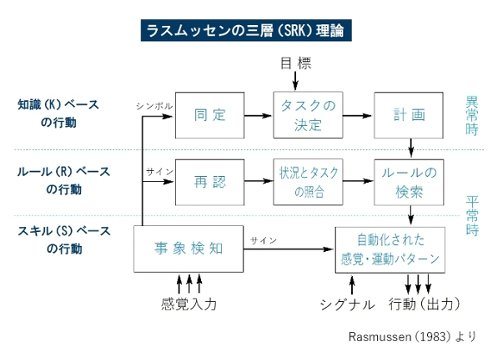
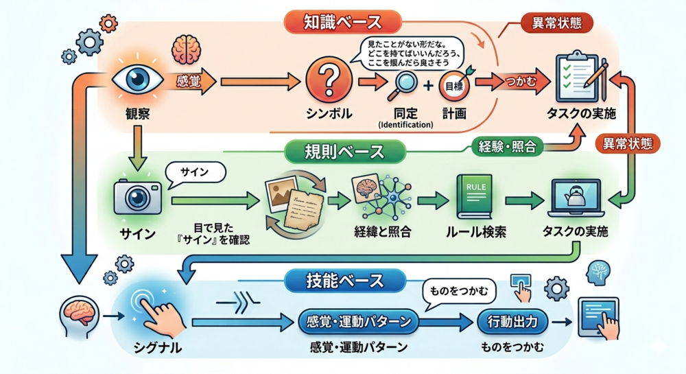
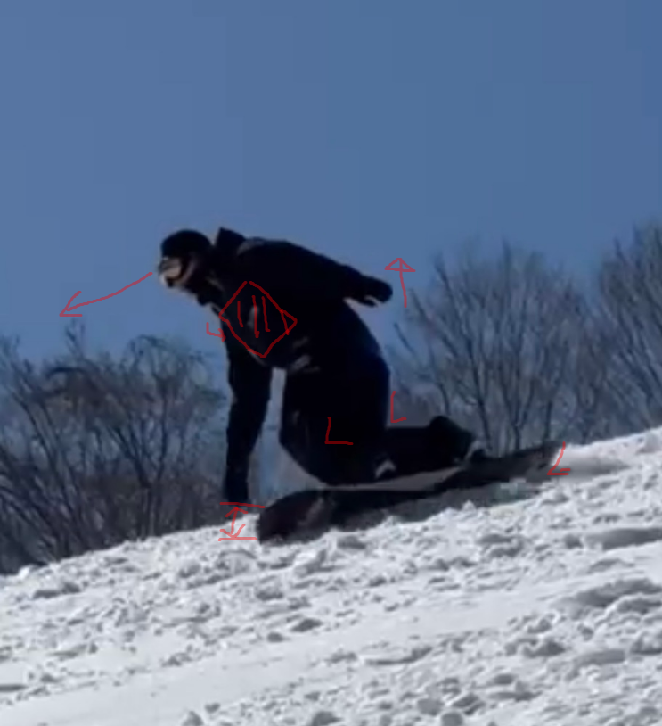

# AI時代の「スキル」の育て方

〜できることを増やして、チームを強くする〜

---

## いろんなところで応用できる
🙆‍♂️ 仕事
🙆‍♂️ 趣味
🙆‍♂️ 生活

---

- 経験したことは言語化する
- 言語化したことから「規則」を抽出する
- できることは「規則」に落とし込み共有する

 

## 「規則」がチームの共通言語になる

---

`できることを増やして、チームを強くする`

---

`できることを増やして、チームを強くする`

 

当たり前な話に聞こえる🤔

---

`できることを増やして、チームを強くする`

 

「できる」とはどういうことか？
「できる」ことが増えるとチームを強くなるのか？

---

`できることを増やして、チームを強くする`

 

➡<mark>「できる」とはどういうことか？</mark>
「できる」ことが増えるとチームを強くなるのか？

---

### 何が「できる」？💭

---

### 何が「できる」か？💭

 

- プログラミングが「できる」
- 
- 

---

### 何が「できる」か？💭

 

- プログラミングが「できる」
- 車の運転が「できる」
- 

---

### 何が「できる」か？💭

 

- プログラミングが「できる」
- 車の運転が「できる」
- 歩くことが「できる」

---

### 何が「できる」か？💭

 

- <mark>（考えながら）</mark>プログラミングが「できる」
- <mark>（手順通りに）</mark>車の運転が「できる」
- <mark>（無意識に）</mark>歩くことが「できる」

---

意識的に「できる」、無意識に「できる」は違う

---

### AIを使うことは「できる」？💭

 

- <mark>（考えながら）</mark>AIを使うことが「できる」
- <mark>（手順通りに）</mark>AIを使うことが「できる」
- <mark>（無意識に）</mark>AIを使うことが「できる」

---

# 🤯

---

### AIを使うことが「できる」？💭

 

- （考えながら）<mark>プロンプトを作ること</mark>が「できる」
- （手順通りに）<mark>AIを呼び出すこと</mark>が「できる」
- （無意識に）<mark>AIと対話すること</mark>が「できる」

---

## 「できる」行為の粒度も重要

---

「できる」とは？

 

意識的、無意識は違う
できる行為の粒度も重要

---

<!-- _footer: "安全運転管理あれこれ記 - 有限会社 シグナル http://www.signal-net.co.jp/2018/09/srk.html" -->

---

---

Knowledge：調べれば
Rule：考えながら
<mark>Skill：考えなくても</mark>

---

Knowledge：調べれば
<mark>Rule：考えながら</mark>
Skill:考えなくても

---

<mark>Knowledge：調べれば</mark>
Rule：考えながら
Skill：考えなくても

---

### どれが一番というわけではない

- Knowledge
    - 認知負荷高、判断早くない
    - <mark>未知にも対応できる</mark>
- Rule
    - 認知負荷中、判断早くない
    - 既知の対処には対応できる
- Skill
    - <mark>認知負荷低、判断早い</mark>
    - 既知の対処には対応できる

---

### SRKモデルでどのレベルか把握する

- 例: 「車を運転する」
    - Knowledge: 何をすべきか都度調べる。教習所に行く。
        - 人に教わりながら、練習する。
    - Rule: 手順を確認する。
        - 手順が間違っていないか確認しながら、練習する。
    - Skill: 無意識に操作できる。
        - でも、うっかりで事故を起こさないでね。

---

`できることを増やして、チームを強くする`

 

「できる」とはどういうことか？
➡<mark>「できる」ことが増えるとチームを強くなるのか？</mark>

---

## 「できる」ことが増えるとチームを強くなるのか？

---

## チームを強くするプロセス

1. 観察する。
2. 言語化する。
3. 試す。
4. パターン化する。
5. 反復して身体化する。

---

## チームを強くするプロセス

1. 観察する。
2. 言語化する。
3. 試す。
4. パターン化する。
5. 反復して身体化する。
6. <mark>4をチームに共有する。5は個人で継続する。</mark>

---

<small>転ぶ → なぜを言語化 → 試す → うまくいく条件を抽出 → 反復。</small>

---

<small>転ぶ → <mark>なぜを言語化</mark> → 試す → うまくいく条件を抽出 → 反復。</small>

---

はい、これでみなさんも滑れるようになりました!?

---

## 言語化は有効だが、情報を削る

---

> 身体化された知識を言語化する時、情報が失われる。言語化された知識を身体化する時、新しい情報が生まれる。つまり、変換は可逆ではない。
> 後輩が獲得した身体化された知識は、私が持っている身体化された知識と、同じではない。似ているが、同じではない。

<!-- _footer: "おい、言語化しろ - じゃあ、おうちで学べる https://syu-m-5151.hatenablog.com/entry/2025/11/14/112023" -->

---

## 変換は可逆ではない

身体知を言語化すると、情報は削れる。
言語を身体化すると、新しい情報が生まれる。

---

## それでも言語化が必要

ただし「全部」を言語化しようとしない。

---

## 言語でスキルを共有するとき規則ベースで行う

技能ベースはそのまま相手にスキルを移植できない。

---

入力が不完全であっても、ナレッジから必要な情報を引き出す体験

---

ユーザーのスキルが未熟（入力が不完全）を、運営側の規則ベース（ナレッジ）に引き込む設計が機能している

---

### 言語化で相手に何かを促すポイント

相手がどのようなスキルレベルにいるのかを把握する
スキルレベルに合わせて、適切な粒度で規則ベースの提供をする

---

「できる」ことが増えてチームを強くする

---

### 人間に伝えた言語はAIも伝わる

- 規則ベース を Agent Skillsへの転用
    - 「こう指示すればこう動く」という型（プロンプト術）を覚える（効率的になる）。

---

## 個人と組織を強くする3ステップ

1. 知識ベースを恐れず経験する
2. 知識を規則へ押し上げる
3. 技能を規則へ落とし込み共有する

---

`できることを増やして、チームを強くする`

 

「できる」とはどういうことか？
「できる」ことが増えるとチームを強くなるのか？

---

# 参考

- ラスムッセンの人間行為の3階層（SRK）
- Ecological interface design（Wikipedia）
- Rasmussen's S-R-K 30 Years Later（David Woods, 2009）
- 意図予測検索（Helpfeel）

