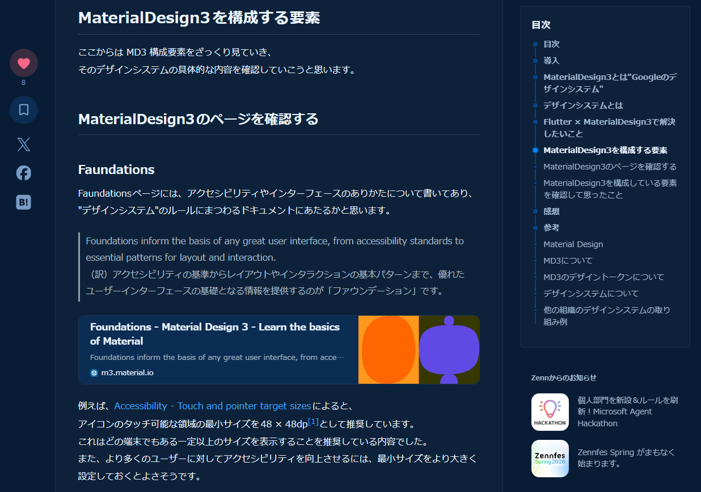
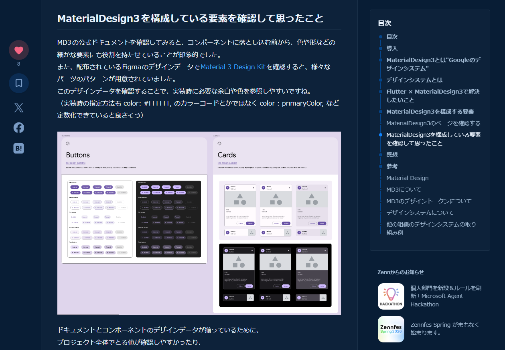
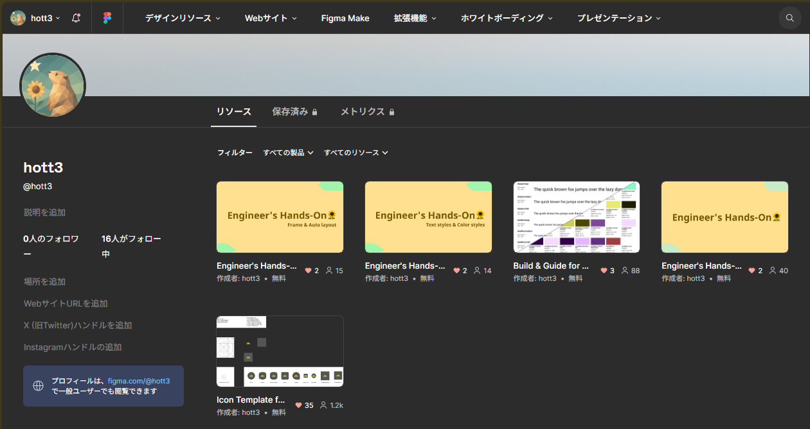
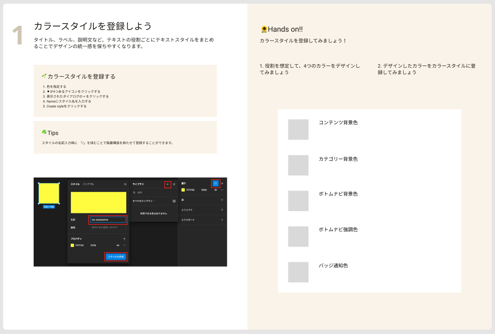
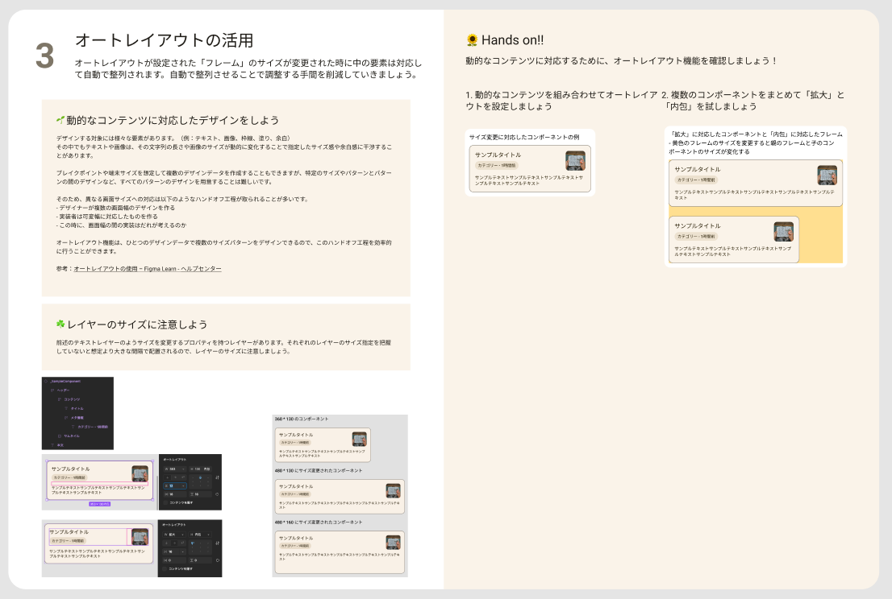
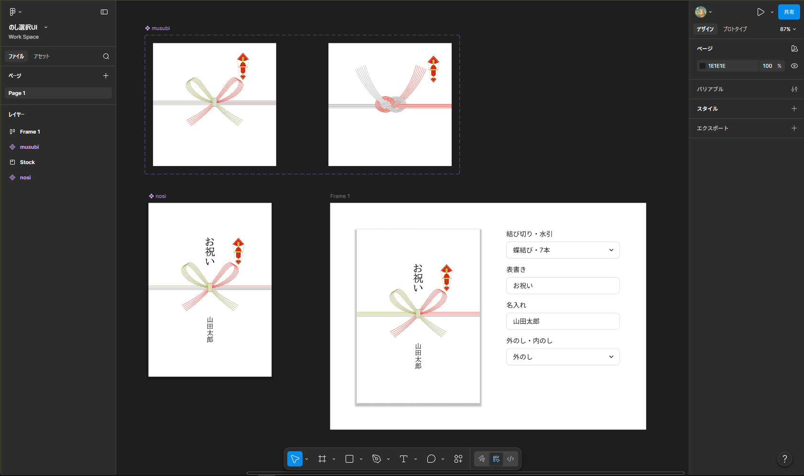
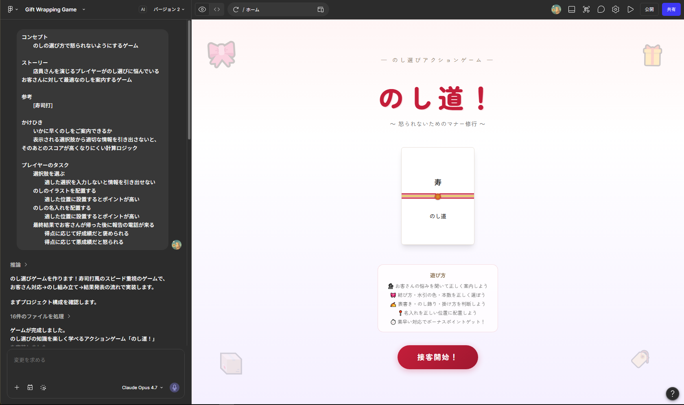
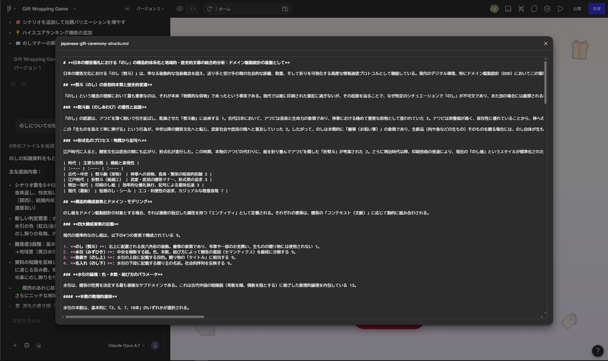
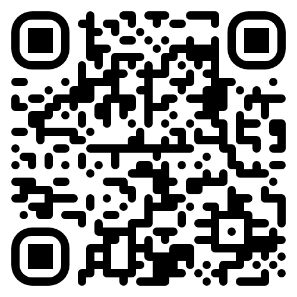

# デザインとエンジニアリングの両軸だから解決できること

〜実現可能なデザインとユーザーの課題を解決するエンジニアリングの両立〜

---

デザインと実装をシームレスに横断する
「デザインエンジニア」です

---

### 強み

- ロジカルに物事を捉え、構造的な情報設計を行う力
- デザインの文脈を理解し、言語化されていない要求を汲み取る力
- デザインシステムを構築し、デザインと実装の生産性を高める

---

### 目指していること

- より使われるアプリを開発するため
- クライアントに価値提供するため

### 実現したいこと

- 開発で培った知識を活かし、実装を理解したUI/UXデザインで、スムーズな合意形成を通じて、要件定義から実装まで一貫して伴走し、プロダクトの価値を最大化する

---

## 3つの成果

1. **デザインシステムとFigmaの活用**
FigmaとFlutterを用いた実装とデザインを直結させる取り組み

2. **チームの生産性を高めるイネーブルメント活動**
チーム全体の開発効率を改善するため、文化醸成活動と具体的な設計提案

3. **複雑な知識の体系化とプロトタイピング**（※個人活動）
UIの提案に留まらない根本的な課題解決の姿勢とプロトタイピングによる価値検証アプローチ

---

### 1. デザインシステムとFigmaの活用

- **課題:** Flutter開発において、Material Design 3の理解不足と、デザインをゼロから実装する調整コストの肥大化。
  - 例）Reset CSSはない。MD3の制約。

---

Material Design 3 のコンポーネント体系を
キャッチアップし展開

---

1からデザインデータを作成するのではなく、Figmaのデザインデータを活用する方法を共有

---

- UIコンポーネントのパッケージ管理システムの実装と、対応するFigmaデザインデータを作成
- エンジニアが実装に入る前に、Figma上で画面デザインをスピーディーに協議できる環境を構築

 

**結果:** <mark>実装とデザインの乖離を未然に防ぎ、開発効率の最大化に貢献</mark>

---

### 2. チームの生産性を高めるイネーブルメント活動

**課題:** デザインデータと実装が対応しておらず、修正のたびに発生する莫大なコミュニケーションコスト。

---

「Engineer's Hands-On」資料を作成し、勉強会を主催

---

チーム内に「デザインを再利用する」文化を提案

---

オートレイアウトやコンポーネントのメリットを言語化

---

- エンジニアがFigmaを正しく読み取るための「Engineer's Hands-On」資料を作成し、勉強会を主催
- オートレイアウトやコンポーネントのメリットを言語化し、チーム内に「デザインを再利用する」文化を定着

 

**結果:** <mark>デザインとコードが1:1で対応するようになり、ハンドオフのコミュニケーションコストの削減と納品直前の修正工数の削減</mark>

---

### 3. 複雑な知識の体系化とプロトタイピング

**課題:** ECサイトの「のし選択」UIにおける、ユーザーの「知識依存」という根本的な複雑性。

---

「のし」選択UIの複雑性 — 根本はユーザーの知識不足

---

複雑なルールをゲーム体験に落とし込む「のし道」を企画

---

AIツールを活用し、少ない手数でコンテキストを作成・パターンの網羅性を確保

---

- 伝統的で複雑なルールの構造を解体し、システムで補完する「のし道」を企画
- AIツールを活用し、少ない手数でコンテキストを作成・パターンの網羅性を確保

 

**結果:** <mark>ユーザーの課題をゲーム体験という「情報構造」で解決するプロトタイピングを実証</mark>

---

「のし道」— 実際に触れてみてください

---

## デザイン領域をリードしたい

より使われるアプリを開発するため
クライアントに価値提供するため

実装を理解したUI/UXデザインで、スムーズな合意形成を通じて、<mark>要件定義から実装まで一貫して伴走し、</mark>プロダクトの価値を最大化する

エンジニアリングのバックグラウンドと、論理的な構造設計の強みを活かし、<mark>実装とデザインのギャップを最小化し、価値を最大化する</mark>
