AI時代のFlutter開発スペシャル by クラスメソッド

##### 【Flutter × AI】<br>AI は Material Design 3 を使って Widget を実装できるのか

###### 〜Figmaデータの秩序がAIの出力に与える影響〜

<br>

2026.5.11
🌻 hott3
X @hott3_


---


###### 自己紹介


- 堀田 誠 （X : @hott3_）
- モバイルエンジニア（Flutter）
- ドコドア株式会社
- 関心：
	- モバイル、デザイン、人が作るもの、ネコ🐈️
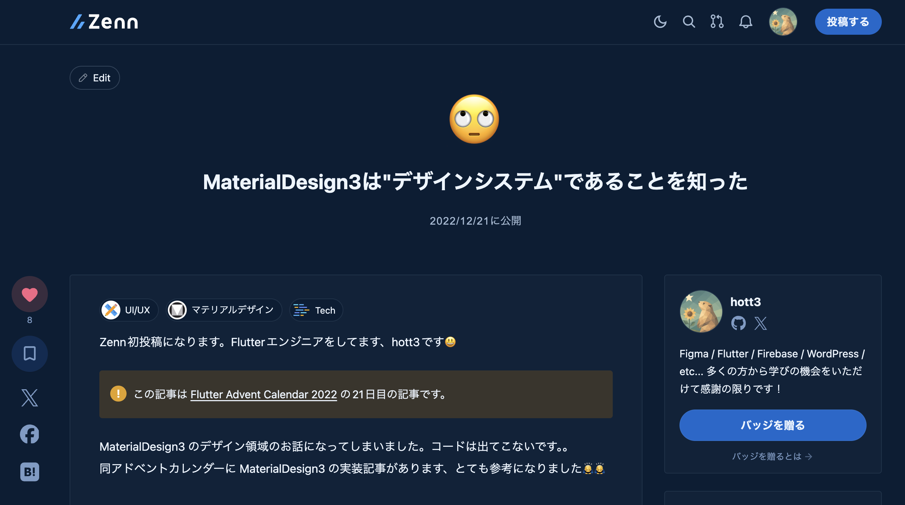 


---


###### TL;DR

- 最近のAIモデルはMD3を理解している
- デザインデータが整っていなくても、ほぼ見た目通りのコードを出力することができる
- エンジニアは、AIに何を期待するかを理解し、戦略を立てる必要がある
  - どんな情報がAIの出力に影響を与えるのか
  - その情報を整えるためにどこまで工数をかけるべきか


---


###### こんなこと聞いたことありませんか？

🗨️ 「AIにFigmaを渡せば、もう一瞬でコードが出るよね」

🗨️ 「いや、まずはデザインシステムを整備しないと、AIも迷っちゃうよ」

🗨️ 「結局、レイヤーをちゃんと構造化（Auto Layoutなど）してないと使い物にならないよ」

🗨️ 「これからはAIへの指示書として『DESIGN.md』を同梱するのが当たり前になりそう」


---


###### 🤔「どこまでデザインデータを整備するか？」

- AIが出力したコードに対して、人間の手直しが発生する可能性
- デザインデータを整えるための工数が確保できない可能性
- デザインデータの構造が、出力されるFlutterのコードの品質に与える影響が不明確

<br>

→ どこまでデザインデータを整備するべきか、明確な指針がない


---


###### 検証

Figma の UI Kit を使ったデザインデータで Material Design 3 のコンテキストを渡せば、<br>AIはMD3準拠のWidgetを選定しやすくなるのではないか？

→ Widgetが選定されやすい条件と、そうでない条件を発見することで、**どこまでデザインデータを整えるべきかの指針を探る**

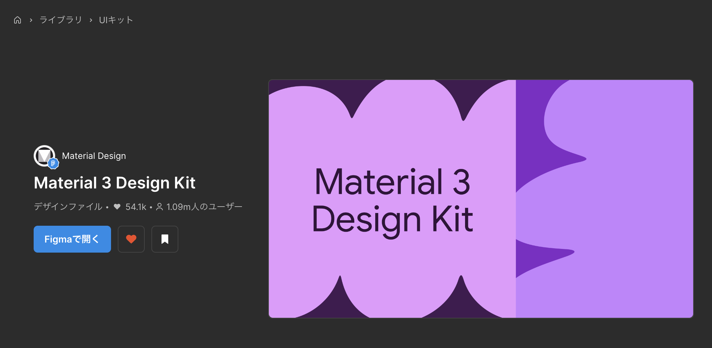 


<!-- _footer: "Material 3 Design Kit | Figma https://www.figma.com/community/file/1035203688168086460" -->


---

<!-- _header: "検証" -->

###### 検証手順

1. FigmaのUI Kitを使って、2つのケースのデザインデータを用意
2. 見た目を維持しつつ、デザインデータを4つの秩序レベルに変更する
3. AIに同一プロンプトを与え、それぞれのデザインのFlutterコードを出力させる
4. 出力されたコードを、MD3準拠のWidget選定、見た目の再現度の観点で評価する

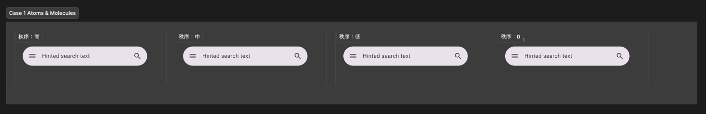 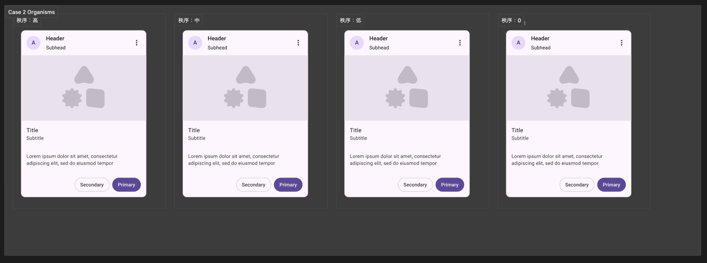

---

<!-- _header: "検証" -->

###### 検証で固定した条件

- Flutter: 3.41.6 / Dart: 3.11.4
- VS Code GitHub Copilot Agent mode を使用
- **Claude 4.6 Sonnet** を使用
- Figma Remote Server を利用 `get_design_context` でデザイン情報を取得
  - `get_screenshot` は指定しない
- Skillsの影響を除外するため Agent Skillsは未使用
- 同一プロンプトを使用
  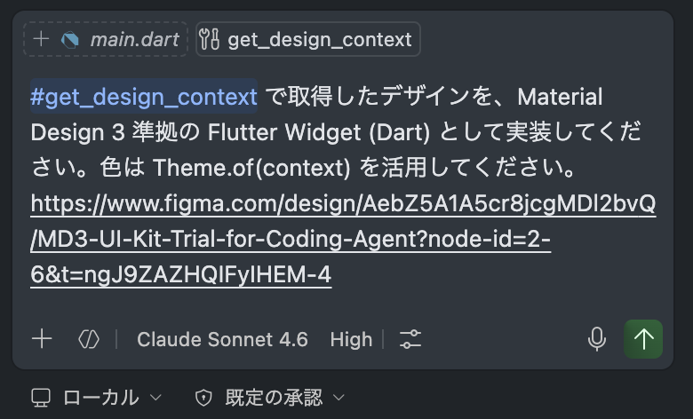


---

<!-- _header: "検証" -->

###### 検証で変更した条件

Figmaのデザインデータの秩序を4段階で変更

| 秩序 |	コンポーネント機能 |	レイヤー名 |	スタイル/バリアブル機能 |	オートレイアウト機能 |	レイヤー構造 |	見た目 |
|---|---|---|---|---|---|---|
| 高 | 維持 | 維持 | 維持 | 維持 | 維持 | 維持 |
| 中 | ❌️ | ❌️ | 維持 | 維持 | 維持 | 維持 |
| 低 | ❌️ | ❌️ | ❌️ | ❌️ | 維持 | 維持 |
| 0 | ❌️ | ❌️ | ❌️ | ❌️ | ❌️ | 維持 |

→ この**秩序レベルの変化をもって、デザインデータがAIの出力に与える影響**を検証する


---

<!-- _header: "Case 1: 検索バー" -->

秩序：高
UI Kitそのままのデザイン

| 秩序 |	コンポーネント機能 |	レイヤー名 |	スタイル/バリアブル機能 |	オートレイアウト機能 |	レイヤー構造 |	見た目 |
|---|---|---|---|---|---|---|
| 高 | 維持 | 維持 | 維持 | 維持 | 維持 | 維持 |

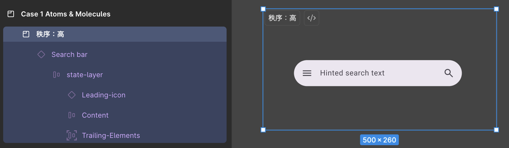


---

<!-- _header: "Case 1: 検索バー" -->

秩序：中
コンポーネントを切り離しレイヤー名を変更したデザイン

| 秩序 |	コンポーネント機能 |	レイヤー名 |	スタイル/バリアブル機能 |	オートレイアウト機能 |	レイヤー構造 |	見た目 |
|---|---|---|---|---|---|---|
| 中 | ❌️ | ❌️ | 維持 | 維持 | 維持 | 維持 |

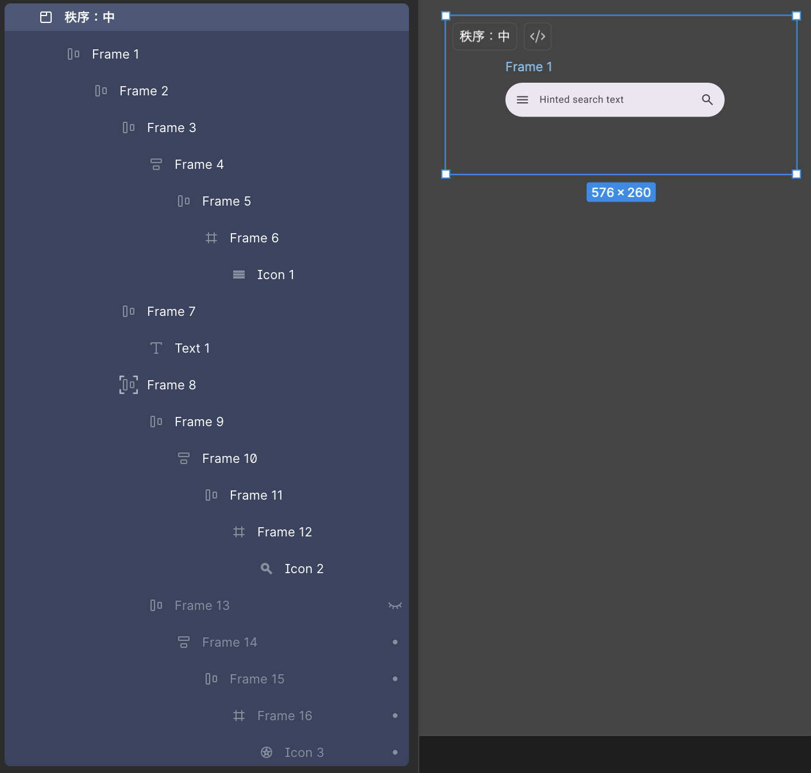


---

<!-- _header: "Case 1: 検索バー" -->

秩序：低
デザイントークンとオートレイアウトを削除したデザイン

| 秩序 |	コンポーネント機能 |	レイヤー名 |	スタイル/バリアブル機能 |	オートレイアウト機能 |	レイヤー構造 |	見た目 |
|---|---|---|---|---|---|---|
| 低 | ❌️ | ❌️ | ❌️ | ❌️ | 維持 | 維持 |

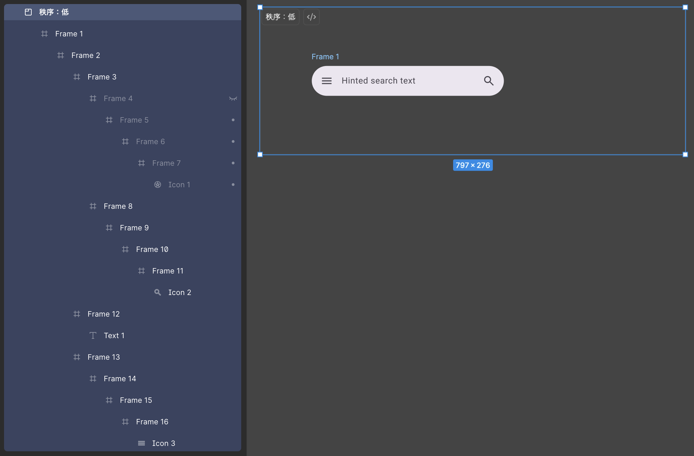


---

<!-- _header: "Case 1: 検索バー" -->

秩序：0
見た目が保てる最低限のレイヤー構造を残したデザイン

| 秩序 |	コンポーネント機能 |	レイヤー名 |	スタイル/バリアブル機能 |	オートレイアウト機能 |	レイヤー構造 |	見た目 |
|---|---|---|---|---|---|---|
| 0 | ❌️ | ❌️ | ❌️ | ❌️ | ❌️ | 維持 |

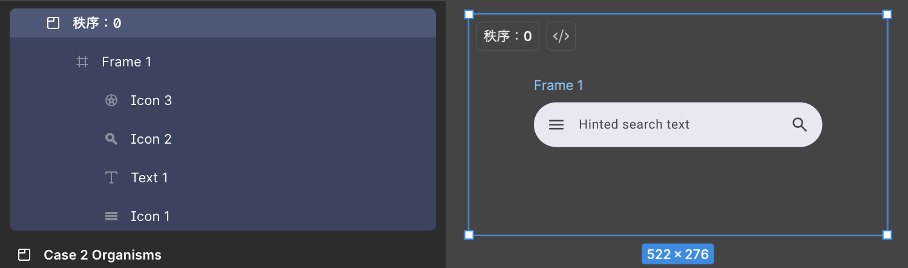


---

<!-- _header: "Case 1: 検索バー" -->

###### 結果：秩序0 のデザインデータをAIに渡して出力されたコード

見た目しか維持されていないデザインデータでも、MD3準拠のWidget選定はされている

```dart
SearchBar(
  hintText: 'Hinted search text',
  hintStyle: WidgetStatePropertyAll(
    Theme.of(context,).textTheme.bodyLarge?.copyWith(color: colorScheme.onSurfaceVariant),
  ),
  textStyle: WidgetStatePropertyAll(
    Theme.of(context,).textTheme.bodyLarge?.copyWith(color: colorScheme.onSurface),
  ),
  backgroundColor: WidgetStatePropertyAll(colorScheme.surfaceContainerHigh),
  shadowColor: const WidgetStatePropertyAll(Colors.transparent),
  leading: Icon(Icons.menu, color: colorScheme.onSurface),
  trailing: [Icon(Icons.search, color: colorScheme.onSurfaceVariant)],
);
```


---

<!-- _header: "Case 1: 検索バー" -->

###### MD3準拠のWidget選定、見た目の再現度

| 秩序 | MD3準拠のWidget選定 | 見た目の再現度 |
|---|---|---|
| 高 | `SearchBar`が使用されている✅️ | 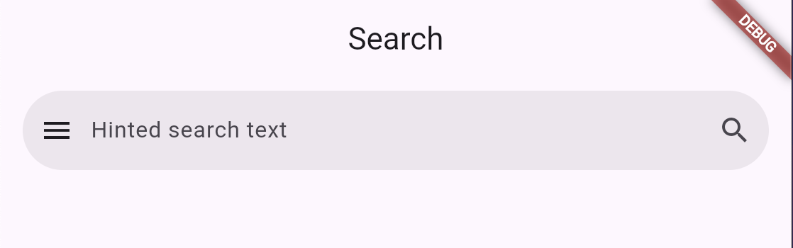 |
| 中 | `SearchBar`が使用されている✅️ | 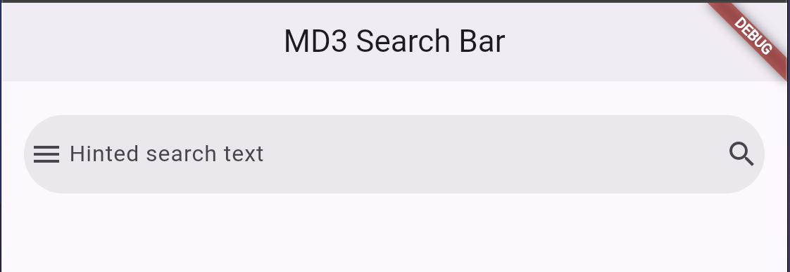 |
| 低 | `SearchBar`が使用されている✅️ | 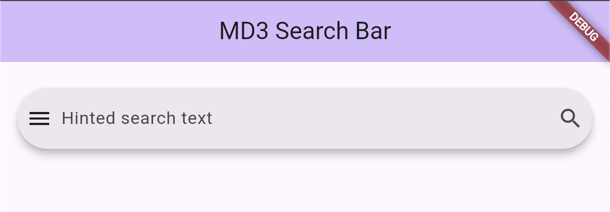 |
| 0 | `SearchBar`が使用されている✅️ |  |

→ MD3準拠のWidgetが選定され、見た目通りのコードが出力されている


---

<!-- _header: "Case 2: 商品カード" -->

###### Case 2: 商品カード

- 秩序：高
  - UI Kitそのままのデザイン
- 秩序：中
  - コンポーネントを切り離しレイヤー名を変更したデザイン
- 秩序：低
  - デザイントークンとオートレイアウトを削除したデザイン
- 秩序：0
  - 見た目が保てる最低限のレイヤー構造を残したデザイン

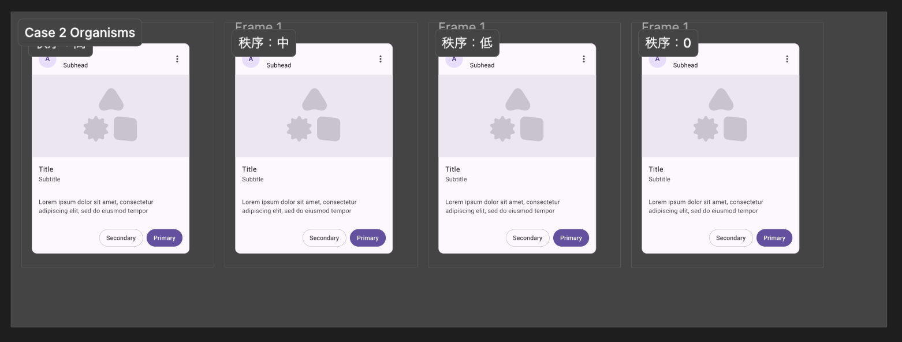


---

<!-- _header: "Case 2: 商品カード" -->

<br>

###### 秩序：0 のデザインデータをAIに渡して出力されたコード

見た目しか維持されていないデザインデータでも、MD3準拠のWidget選定はされている

```dart
〜略〜

@override
Widget build(BuildContext context) {
  final colorScheme = Theme.of(context).colorScheme;
  final textTheme = Theme.of(context).textTheme;

  return Card(
    clipBehavior: Clip.antiAlias,
    child: SizedBox(
      width: 360,
      child: Column(
        mainAxisSize: MainAxisSize.min,
        crossAxisAlignment: CrossAxisAlignment.start,
        children: [
          _Header(
            〜略〜
          ),
          _ImageArea(imageWidget: imageWidget, colorScheme: colorScheme),
          _Content(
            〜略〜
          ),
        ],
      ),
    ),
  );
}
```


---

<!-- _header: "Case 2: 商品カード" -->

| 秩序 | MD3準拠のWidget選定 | 見た目の再現度 |
|---|---|---|
| 高 | `Card / OutlinedButton / FilledButton`が使用されている✅️ |  |
| 中 | `Card / OutlinedButton / FilledButton`が使用されている✅️ | 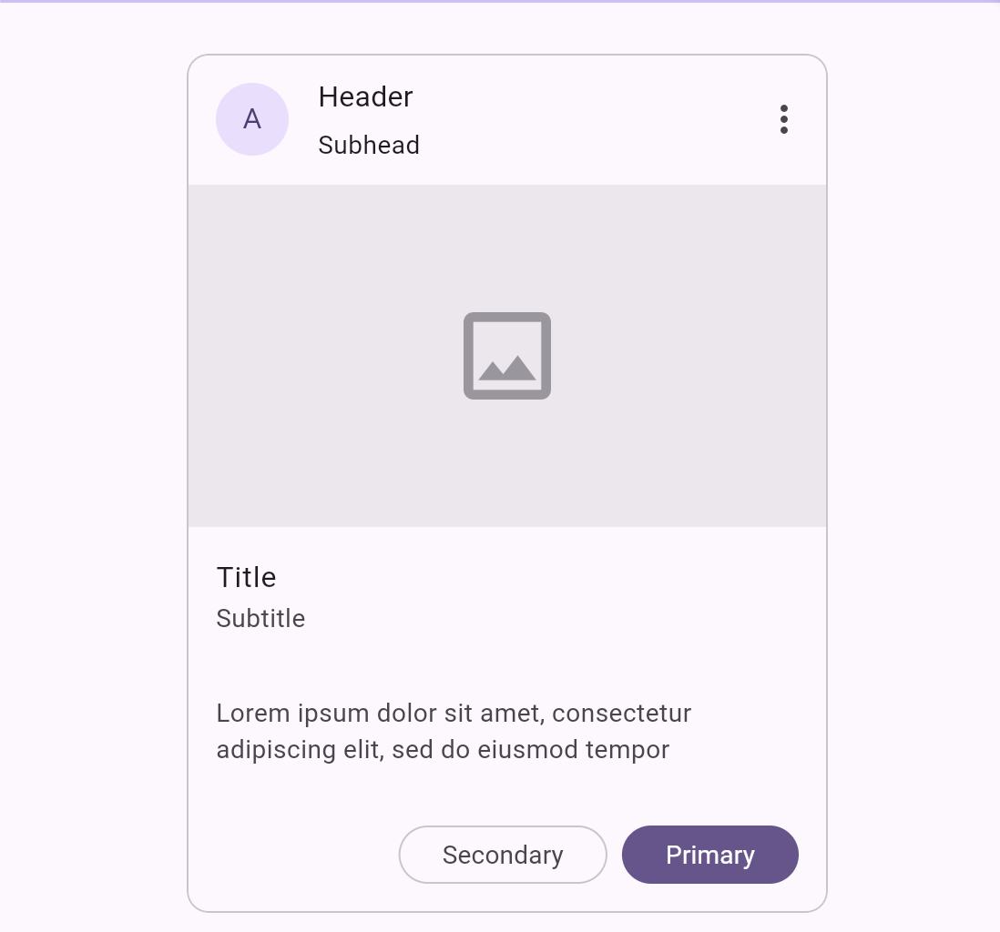 |
| 低 | `Card / OutlinedButton / FilledButton`が使用されている✅️ | 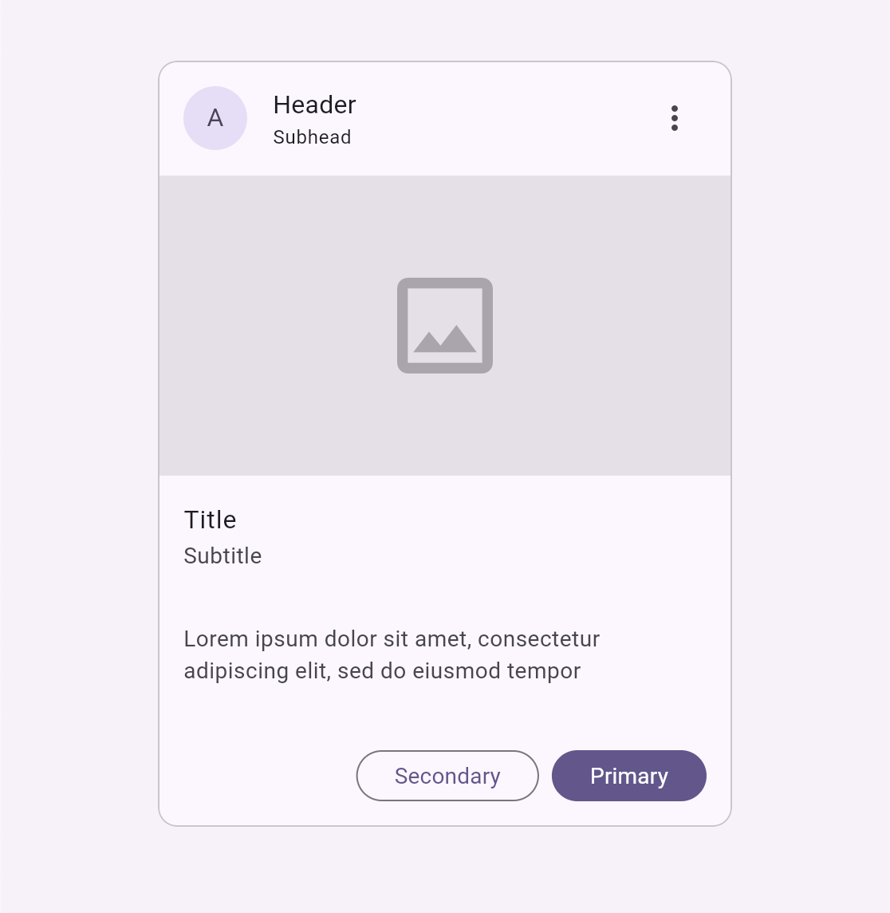 |
| 0 | `Card / OutlinedButton / FilledButton`が使用されている✅️ | 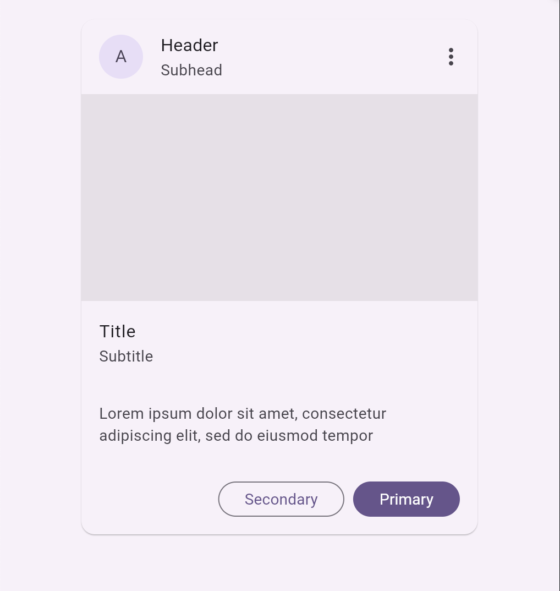 |

→ MD3準拠のWidgetが選定され、見た目通りのコードが出力されている


---

<!-- _header: "考察" -->

###### 検証結果

- 秩序レベルを下げても、MD3準拠のWidget選定はされ、見た目通りのコードが出力されている
  - つまり、AIは「これがSearchBarだ」と推論できている

→ MD3のUI Kitを使うことが、AIに対して「このデザインはMD3のコンポーネントだ」という強い文脈を与られると予想していたが、デザインデータを破壊してもWidgetを選定できていた


---

<!-- _header: "考察" -->

###### 検証中に気づいたこと

🤔なぜ秩序0のデザインデータでも、MD3準拠のWidget選定がされていたのか？

- Case 1の秩序低で`get_screenshot`が使われていた
  - FIgma MCP Serverの`get_design_context`のみ指定し、デザインデータを利用する想定だった
  - 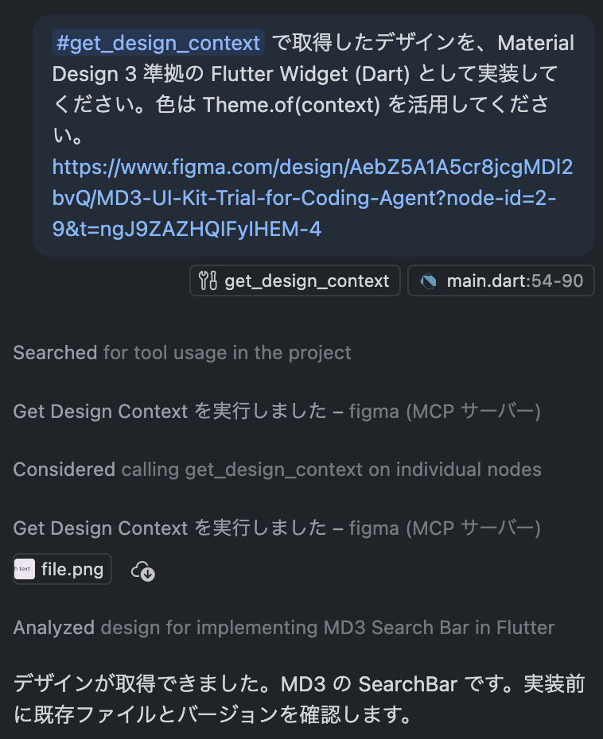

→ つまり、AIがにスクリーンショットも取得して視覚情報をもとに見た目の実装を行っていた


---

<!-- _header: "考察" -->

###### 新しい仮説とそこからわかること

事実として、AIはレイヤー構造が崩れていても、視覚情報からUIデザインを推論している
（Flutter と MD3 という世界中で広く公開されているパターンで学習されているために、AIが必要なWidgetを推論しやすかった可能性がある）

<br>

→ つまり、<br>**構造化されていないデザインデータがAIの出力の品質を、必ず下げるわけではない**

<!-- _footer: "※LLMの性質上、毎回同一結果にはならないことに注意" -->


---

<!-- _header: "提案" -->

###### これからの行動指針① 「デザインデータを構造化する呪縛から抜け出す」

**❌ 間違った考え**
- AIにコードを書かせるために、Auto Layout を完璧に整えることにこだわる
- レイヤー名をすべて正式名称に統一することを必須とする
- デザインデータを整備することでオーバーヘッドを発生することを恐れ、AIに何を期待できるか把握していない状態でAIにコードを書かせる

**✅ 正しい考え**
- Figma は人間が思考/合意形成/UIを検証するためのキャンバス
  - アプリケーションの実態ではなく、アプリを作るための中間成果物である
- デザインデータに完璧な秩序を求めるのではなく、目的に応じて優先度の高いところから整えることが重要


---

<!-- _header: "提案" -->

###### これからの行動指針② 「独自のブランドデザインを『逆算』させる」

**💭 今回の前提**
- MD3は広く公開されているデザインシステム
- Flutterは広く公開されているUIフレームワーク
- AIは公開されているパターンを学習している

**💡 独自のブランドデザインを推論させるには**
- AI は途端に「推測」できなくなる可能性がある
- DESIGN.md やデザイントークンを通じて、ブランド独自のデザイン知識をAIに与える
- ブランド独自のデザイン知識をすべて与えることは、工数的にも効率的にも難しい
- ブランド独自のデザインを実装するために必要な情報の中から、AIが推論するために必要な情報を見極めて、優先的に整える


---


###### TL;DR（Again）

- 最近のAIモデルはMD3を理解している
- デザインデータが整っていなくても、ほぼ見た目通りのコードを出力することができる
- エンジニアは、AIに何を期待するかを理解し、戦略を立てる必要がある
  - どんな情報がAIの出力に影響を与えるのか
  - その情報を整えるためにどこまで工数をかけるべきか

→ **中核的なブランドデザインの実装は、人間とAIがどちらも利用できるように、設計することが重要だと考えます！**


---


###### 参考資料

Material 3 Design Kit | Figma
https://www.figma.com/community/file/1035203688168086460

Figma MCP の get_design_context は何を返すのか — 実データで読み解く中間表現
https://zenn.dev/yokkomystery/articles/932cacd7728188


Set up the remote server (recommended) | Developer Docs
https://developers.figma.com/docs/figma-mcp-server/remote-server-installation/


