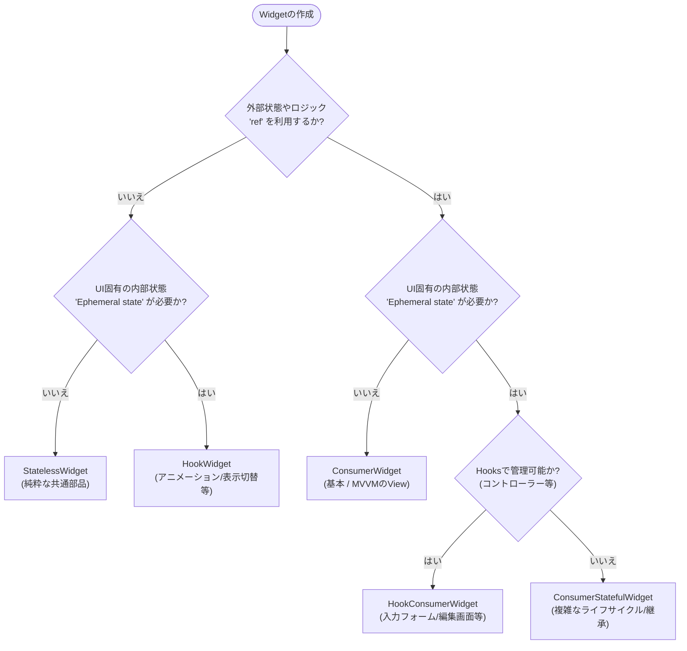

# 状態管理に迷わないためのフローチャート

## App State と Ephemeral State、そしてMVVM

Flutterの状態管理は「どこで管理するか」が明確になれば迷わない

---

# なぜ今、宣言的UIなのか

## 命令的UI vs 宣言的UI

**命令的UI（タクシーの例）**
- 「次の角を右に曲がって、100m進んで、そこで止まってください」
- 一歩ずつ指示する

**宣言的UI（目的地を伝える）**
- 「東京駅に行ってください」
- 結果だけ伝える。ルート（更新処理）はフレームワークが担当

---

# すべてのUIは状態の結果である

<br />
<br />

## `UI = f(state)`

<br />

- すべてのUIは状態（データ）の結果である
- Flutterでは状態が変わるとWidgetが再構築される

---

# 「状態」という言葉の曖昧さ

## 状態には2つの種類がある

**Ephemeral State（一時的な状態）**
- 単一Widgetの中だけで完結する状態

**App State（アプリケーション全体の状態）**
- アプリケーション全体で共有する状態

どちらに分類するかは厳密ではなく、アプリの成長に応じて変わる

---

# 状態は成長する

## Ephemeral State が App State へ昇格することがある

**例: 選択された商品ID**

- 最初: 単一画面内でのみ有効 → **Ephemeral State**
- 成長後: 詳細画面やカート画面でも必要 → **App State**

アーキテクチャ設計では将来的なリファクタリングも想定する

---

# Ephemeral State（一時的な状態）

## 単一Widgetの中だけで完結する状態

**別名:** UI状態、ローカル状態

**例:**
- `PageView`の現在ページ
- アニメーションの進行状況
- `BottomNavigationBar`の選択タブ

---

# Ephemeral Stateの実装 - TextFieldの例

## TextFieldの入力にRiverpodは不要

```dart
// HookWidgetの例
class MyForm extends HookWidget {
  @override
  Widget build(BuildContext context) {
    final controller = useTextEditingController();
    
    return TextField(controller: controller);
  }
}
```

なぜRiverpodを使う必要がないのか: 他のWidgetと共有する必要がないため

---

# flutter_hooksで簡潔に

## flutter_hooksを使うとStatefulWidgetのボイラープレートが不要

```dart
// StatefulWidgetの場合（冗長）
class MyForm extends StatefulWidget {
  @override
  _MyFormState createState() => _MyFormState();
}
class _MyFormState extends State<MyForm> {
  late TextEditingController controller;
  @override
  void initState() {
    super.initState();
    controller = TextEditingController();
  }
  @override
  void dispose() {
    controller.dispose();
    super.dispose();
  }
  // ...
}
```

```dart
// HookWidgetの場合（簡潔）
class MyForm extends HookWidget {
  @override
  Widget build(BuildContext context) {
    final controller = useTextEditingController();
    return TextField(controller: controller);
  }
}
```

---

# App State（アプリケーション状態）

## アプリケーション全体で共有し、セッション間で保持する状態

**例:**
- ユーザー設定
- ログイン情報
- SNSの通知
- ECサイトのカート
- ニュースアプリの既読/未読状態

---

# App Stateの影響範囲

## ログイン状態やカートの例で広範な影響範囲を理解する

**ログイン状態の例:**
- 複数画面でユーザー情報を表示
- ログアウト時に全画面に影響

**カートの例:**
- 商品一覧、詳細、カート画面で共有
- どこからでも商品を追加/削除

---

# MVVM（Model-View-ViewModel）

## View、ViewModel、Modelの責任範囲を明確に線引き

```
View ←→ ViewModel ←→ Model
```

**MVVMの3層構成:**
- **Model:** ビジネスロジックとデータ
- **View:** UIの表示
- **ViewModel:** ViewとModelの橋渡し

---

# MVVMの責務分離

## 各層が明確な役割を持つことでテストと保守が容易に

**Model:**
- ビジネスロジックを担当
- データの取得・保存
- UIに依存しない

**ViewModel:**
- Viewに必要な状態を保持
- ユーザー操作を受けてModelを呼び出す
- Viewに表示用のデータを提供

**View:**
- UIの構築のみに専念
- ViewModelの状態を監視して表示
- ユーザー操作をViewModelに通知

---

# Repositoryパターンの追加

## Repositoryでデータソースの実装を分離

```
View ←→ ViewModel ←→ Repository ←→ DataSource
```

**Repositoryの役割:**
- データソース（API、DB）の抽象化
- DTOをドメインモデルに変換
- データキャッシュの管理

---

# Widgetの選択フローチャート

## 状態の種類に応じて適切なWidgetを選択する



---

# Widget使い分け一覧

## 各Widgetの特徴を一目で把握する

| Widget名 | 外部状態(ref) | 内部状態(Hooks/State) | 主なユースケース | MVVMにおける役割 |
|---------|-------------|---------------------|---------------|----------------|
| StatelessWidget | ❌ | ❌ | 共通ボタン、単純なレイアウト | 純粋なUIコンポーネント |
| HookWidget | ❌ | ✅(Hooks) | アニメーション、表示のON/OFF | 内部ロジックを持つUI |
| ConsumerWidget | ✅ | ❌ | プロフィール表示、商品一覧 | MVVMの標準的なView |
| HookConsumerWidget | ✅ | ✅(Hooks) | 入力フォーム、検索窓 | 編集機能を持つView |
| ConsumerStatefulWidget | ✅ | ✅(State) | 複雑なライフサイクル、Mixin利用 | 特殊な要件のView |

---

# MVVMを厳格に守る場合の推奨

## ビジネスロジックはすべてViewModelへ

MVVMを厳格に守る場合:
- 多くの画面は**ConsumerWidget**で完結
- 入力フォームがある画面は**HookConsumerWidget**

効率的な開発が可能

---

# ConsumerWidget実装例

## ViewModelの状態を監視してUIを構築

```dart
class TodoListView extends ConsumerWidget {
  @override
  Widget build(BuildContext context, WidgetRef ref) {
    final todos = ref.watch(todosProvider);
    
    return ListView(
      children: [
        for (final todo in todos)
          CheckboxListTile(
            value: todo.completed,
            onChanged: (value) => 
              ref.read(todosProvider.notifier).toggle(todo.id),
            title: Text(todo.description),
          ),
      ],
    );
  }
}
```

---

# AsyncNotifier実装例

## 非同期処理とSSOT（Single Source of Truth）の実現

```dart
@riverpod
class PackageMetrics extends _$PackageMetrics {
  @override
  Future<PackageMetricsScore> build({required String packageName}) =>
    ref.watch(pubRepositoryProvider)
      .getPackageMetrics(packageName: packageName);

  Future<void> like() async {
    await ref.read(pubRepositoryProvider).like(packageName: packageName);
    ref.invalidateSelf();  // 自身を再取得
    ref.invalidate(likedPackagesProvider);  // 関連する状態も再取得
  }
}
```

---

# アーキテクチャの拡張

## 単一画面の話からプロジェクト全体への広がり

**4層レイヤードアーキテクチャ:**
- **Presentation（UI）:** View、ViewModel
- **Application（UseCase）:** ユースケース層
- **Domain（ビジネスロジック）:** ドメインモデル
- **Data（Repository、API）:** データソース

feature-firstの構成を推奨

---

# feature-firstディレクトリ構成

## 機能ごとにディレクトリを分け、関連するコードを近づける

```
lib/
  ui/
    <feature_name>/
      view_models/
      widgets/
  domain/
    models/
  data/
    repositories/
    services/
```

---

# 明日から実践すること

## 状態管理の原則を守り、責務をシンプルに保つ

- **UIは宣言的に書くこと**
- **Viewに必要な状態をViewModelに切り分け、責務をシンプルにする**
- **状態がUIの内部で完結するか見極める**
- **Widget内部だけで扱える状態は内部で完結させる**
- **そうでない状態はWidget外で管理する**

> Widget の内部だけで扱えば良い状態は内部で簡潔させ、そうでない状態は Widget 外で管理する

---

# 参考資料

## さらに学ぶためのリソース

**公式ドキュメント:**
- Riverpod公式: https://riverpod.dev/ja/
- Flutter State management: https://docs.flutter.dev/data-and-backend/state-mgmt

**参考記事:**
- Differentiate between ephemeral state and app state
- draw_your_image を「宣言的」に使えるように作り直した話


